
<h1 align="center">基于java的美食信息推荐系统的设计与实现</h1>

## 简介
Java美食推荐系统：角色分为管理员、用户；功能包括菜谱浏览与管理、饮食资讯发布与编辑、论坛交流互动、用户信息管理、推荐美食搜索与筛选功能。    --计算机毕业设计源码；毕设源码；java毕业设计源码

## 联系方式

<h3 align="center">获取完整代码与数据库文件 + 微信：deepguan QQ: 86050149 QQ群: 783742310</h3>

<h3 align="center">可帮忙远程部署 包运行成功！提供远程部署、修改代码、设计文档指导、代码讲解等服务！</h3>

## 功能介绍（完整见运行截图）
管理员：管理员可以通过管理后台进行账号的登录和退出，并访问多个管理功能模块，如用户管理、菜谱管理、论坛管理和饮食资讯管理等。管理员界面提供了查看与修改个人信息的功能，还可以使用搜索和过滤选项来高效地管理美食信息，包括添加、修改、删除和详情查看，从而便捷地维护系统的运行和内容更新。此外，管理员还负责管理前端显示的轮播图和推荐美食信息，确保用户体验的提升。

用户：用户可以通过简单的登录和注册功能进入系统，访问首页、菜谱、论坛、饮食资讯和个人中心等功能模块。在美食信息推荐系统中，用户能够浏览和搜索不同的菜谱信息、查看详细的菜品介绍与评分、并通过互动功能如评论和点赞参与论坛讨论。用户界面设计简洁，提供个性化的美食推荐和便捷的菜谱浏览功能。个人中心模块允许用户查看和修改个人信息，并管理自己的评论和收藏夹。

## 运行截图
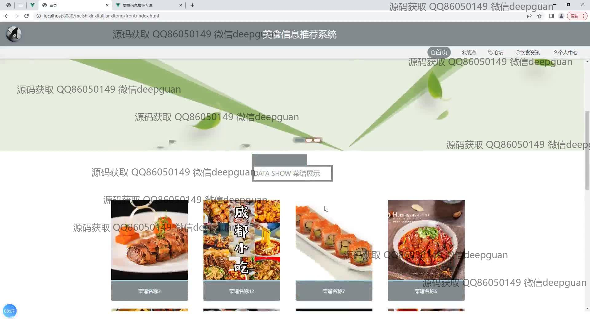
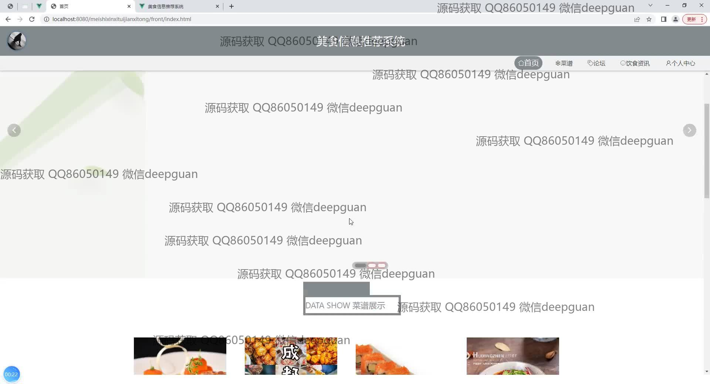
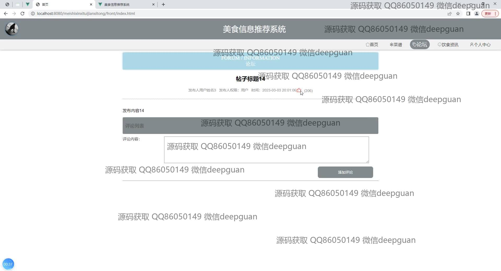
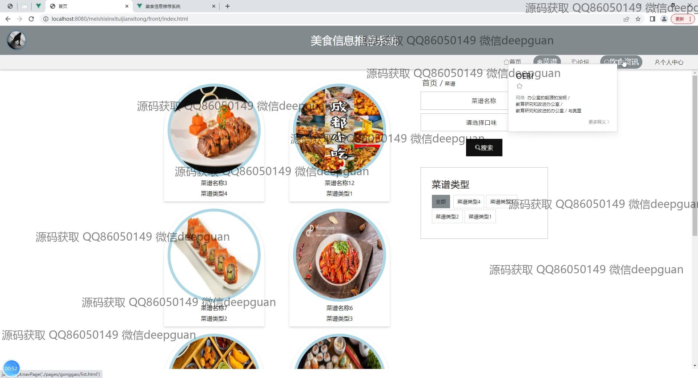
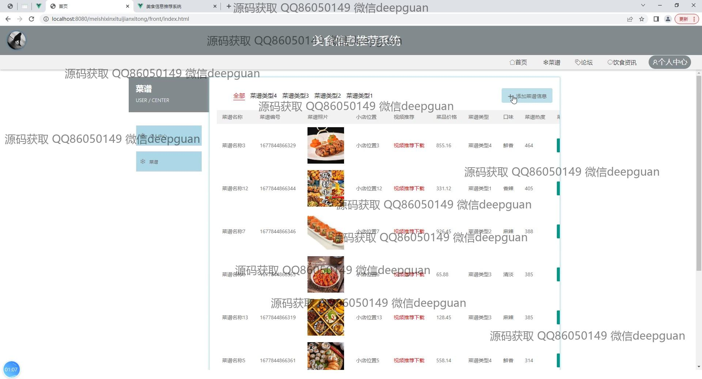
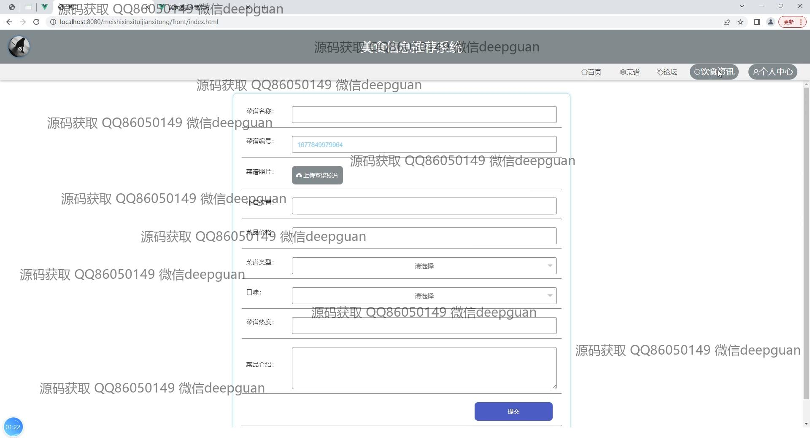
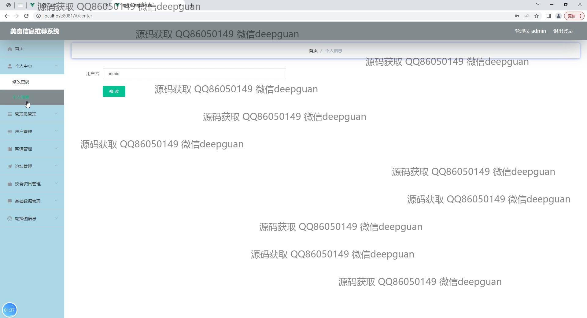
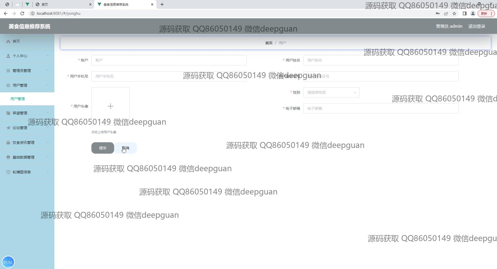
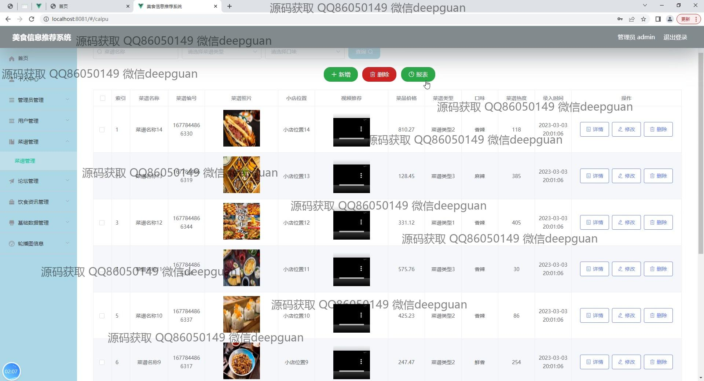
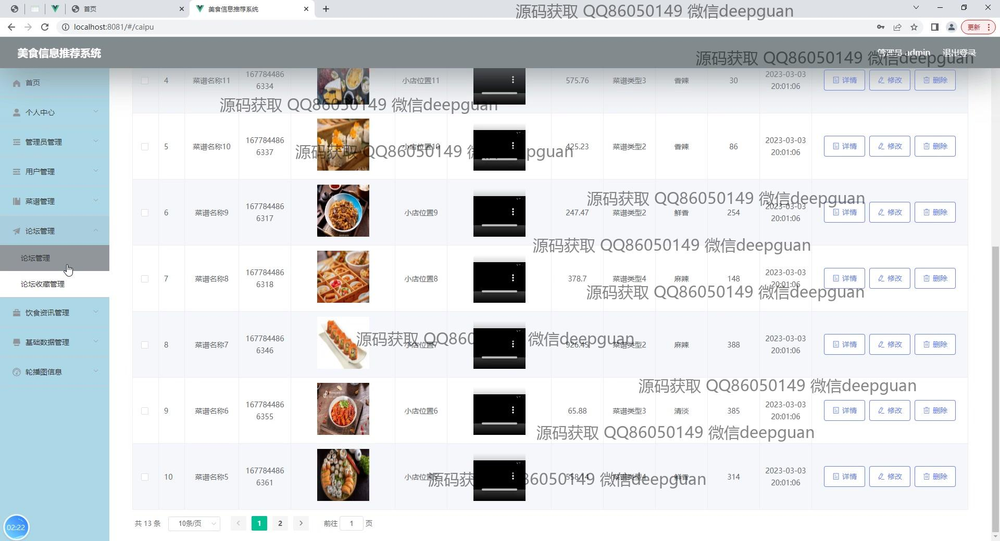
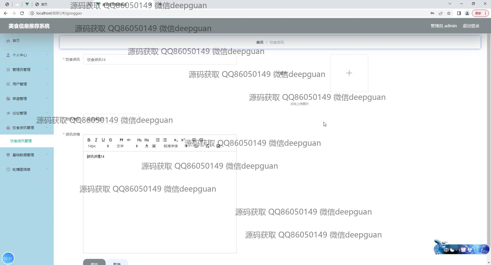
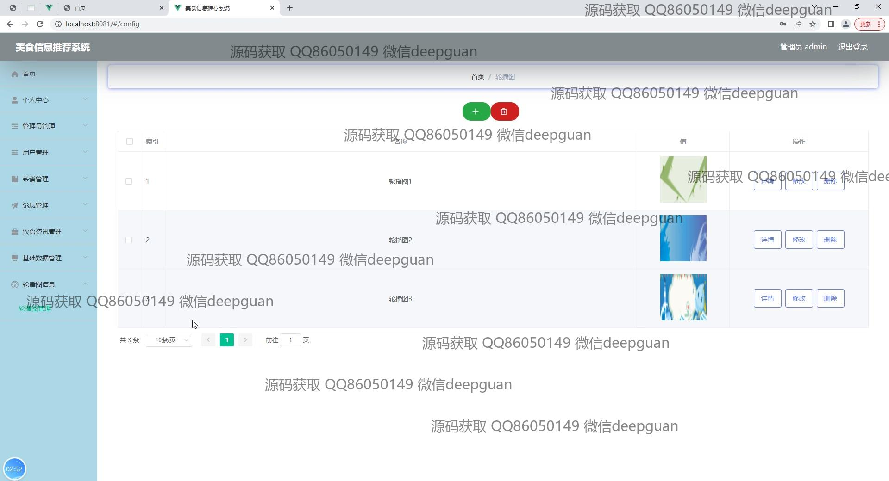
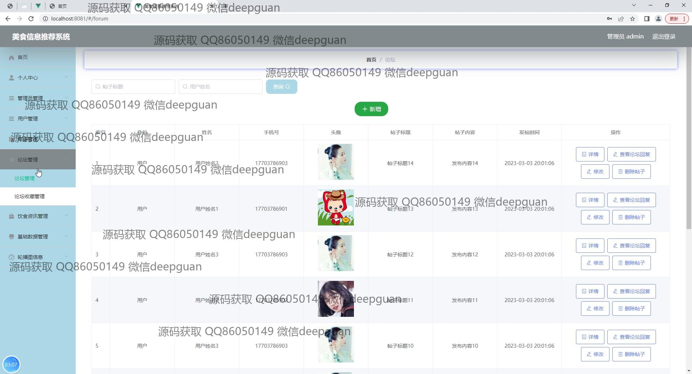

本代码来源于网络,仅供学习参考使用!

